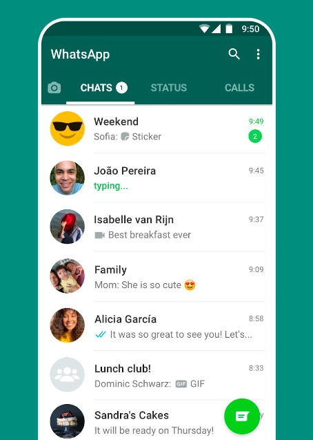
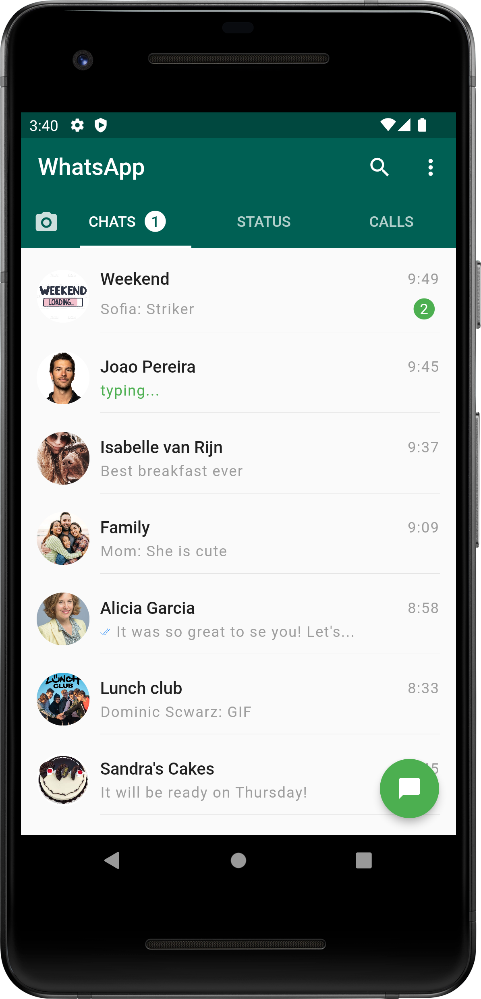
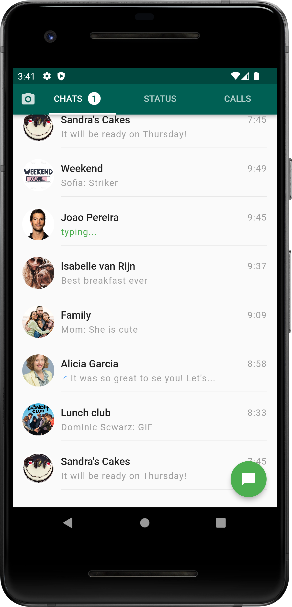

# WhatsApp Clone (UI) - Flutter

This is whatsapp clone UI made with flutter. To made this I used flutter and dart. To make WhatsApp Like Appbar I user SliverAppbar with NestedScrollView.

This project is made for learning purpose. I made this project after joining 3 days Techofic Flutter Bootcamp 2022 by [TECHOFIC](https://www.youtube.com/watch?v=vKTAlsx58rs&list=PL0yFs0YrWE-z2j-jd4IfCwaixZo9tqNOT).

## Assements Task:
UI Cloning - Design this WhatsApp home screen as close as possible from the screenshot below.

 \

Note: Ensure you add the effect - on scrolling down through the conversations list, the AppBar should be hidden, and only TabBar will remain pinned, and on scrolling back to top it should be visible.

### Live Site:

##### [WhatsApp Web](#)

### Download APK/Software:

##### [WhatsApp APK - v1.0.0](#)

## Phone Screenshots:

| Home (Chat) |  Home (Chat - SliverAppBar) | 
| :----:  |  :----:   |  
|  |    |

#### Disclaimer
This project is made only for practice purpose. Anyone can use it but the risk has to be taken by the user. For any query please contact me.

## Repository Owner Info

### Md. Al-Amin
###### Junior Software Engineer (Android & iOS) at Rokomari.com

__Email :__ [ alamin.karno@outlook.com ](mailto:alamin.karno@outlook.com) \
__Github :__ [Md. Al-Amin](https://github.com/alamin-karno) \
__Facebook :__ [মোঃ আল-আমিন খন্দকার কর্ণ](https://facebook.com/alamin.kanro786) \
__Linkedin :__ [Md. Al-Amin](https://www.linkedin.com/in/alaminkarno/) \
__YouTube :__ [Alamin Karno](https://youtube.com/alaminkarno/) \
__Twitter :__ [Md. Al-Amin](https://twitter.com/alamin_karno/)
